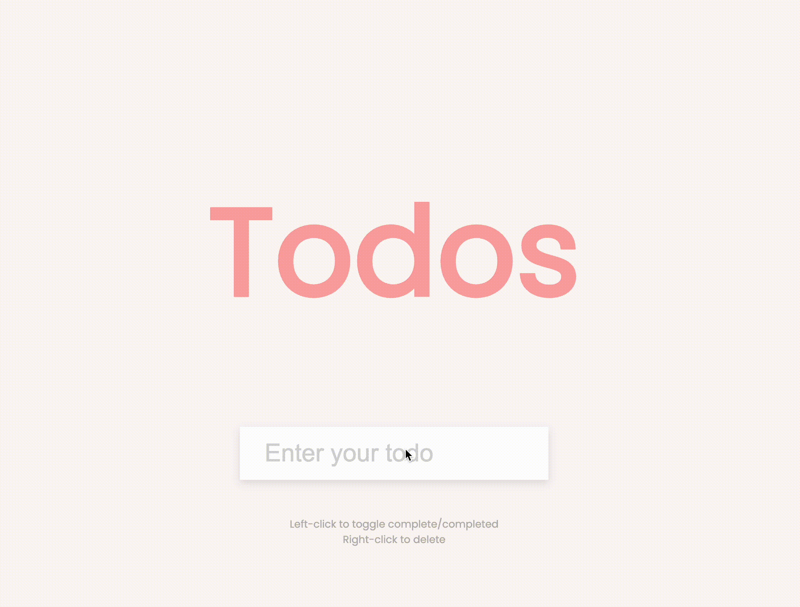

This is a functional JavaScript 'todo' application. You can input what you need to do, you can cross off your todos (left click) and they will stay in the local storage whilst you're on the page, until you delete them (right click).

/////

<!-- Please try the application [here]() -->

